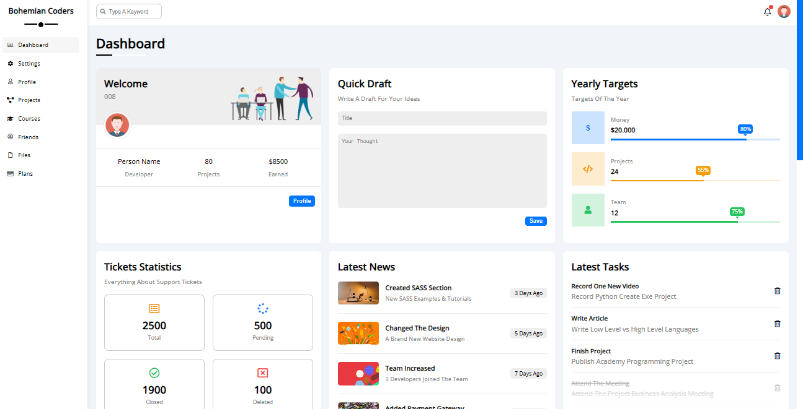
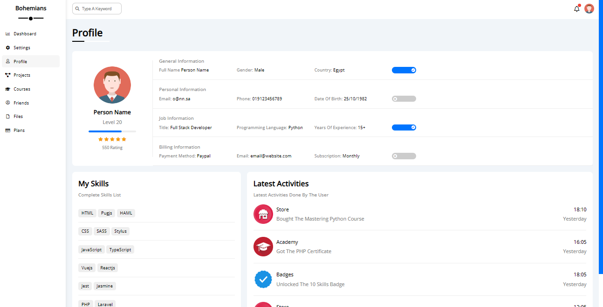
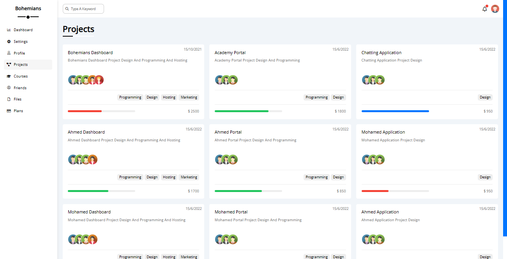
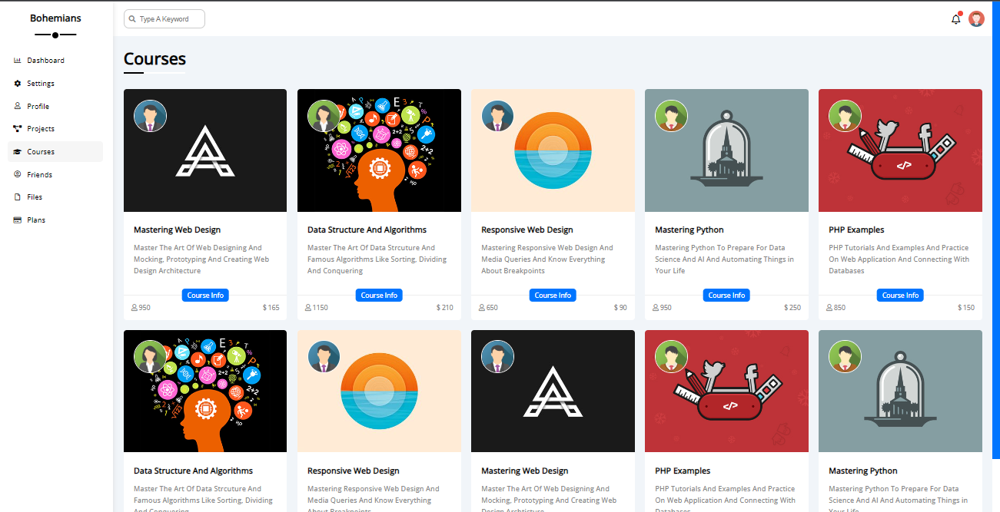
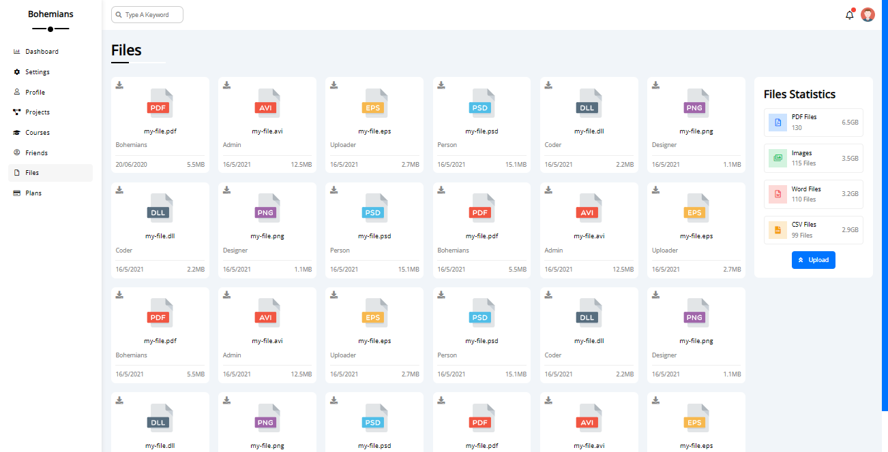
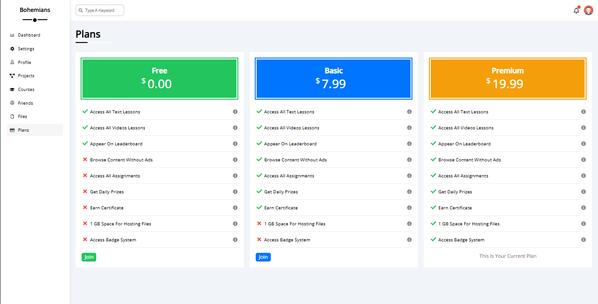

### Simple Dashboard

I am gonna showing to you how to code a Simple Dashboard with only CSS3 and HTML5 and without javascript.

# Screenshot

Here we have project screenshot :

→ Main Dashboard page.

→ Settings.

→ Profile.

→ Projects.

→ Courses.

→ Friends.

→ Files.

→ Plans.

